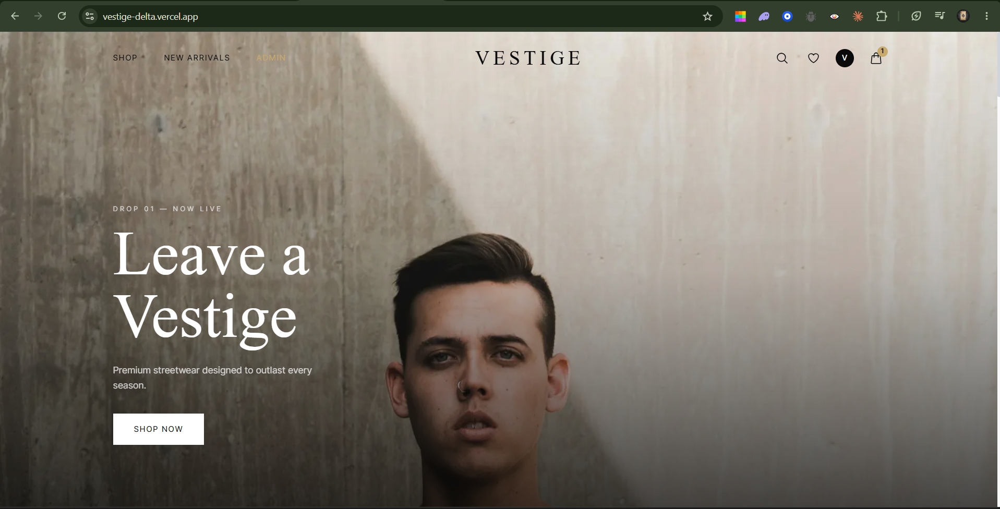
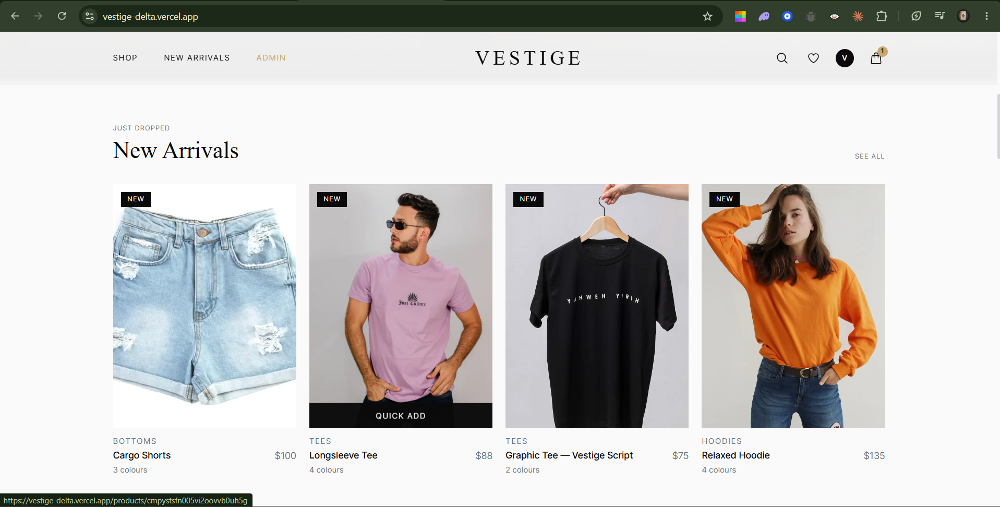
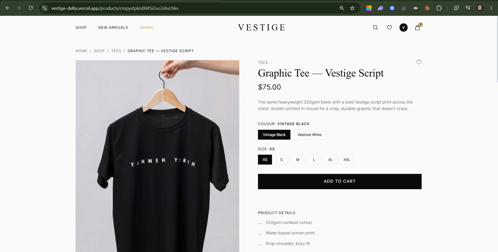
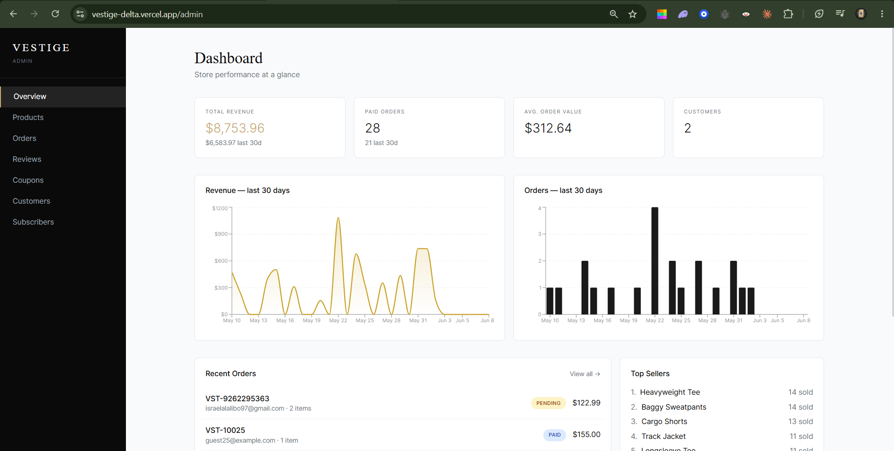
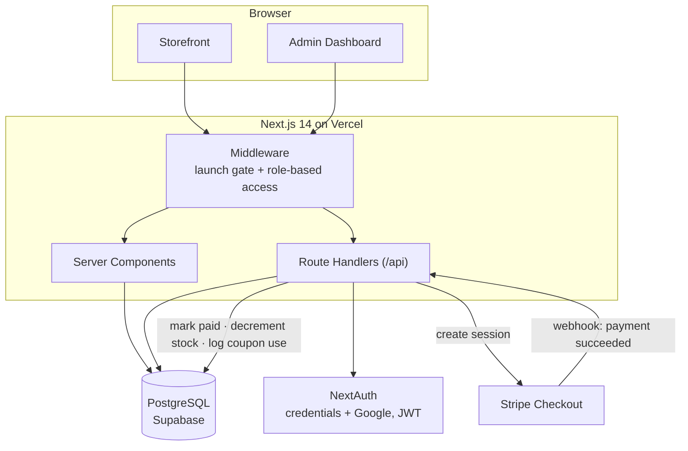

# Vestige — Full-Stack E-Commerce Platform


Vestige is a production-grade e-commerce platform for a streetwear clothing brand, built from the ground up with the Next.js App Router. It pairs a polished, mobile-first storefront with a complete commerce backend — authentication, a real database, payments, inventory, discounts, reviews, and a metrics-driven admin dashboard.

> Built as a full-stack engineering project: a real database, role-based auth, Stripe payments with webhook fulfillment, and an admin panel — not a template or a no-code store.

## Live Demo

🔗 **[vestige-delta.vercel.app](https://vestige-delta.vercel.app)**

> The site is currently behind a pre-launch passcode gate. Use the access code provided in the application or contact me for early-access credentials.

## Screenshots

<p align="center">
  
</p>

<p align="center">
  
  &nbsp;
  
  &nbsp;
  
</p>


## Tech Stack

| Layer | Technology |
|---|---|
| Framework | Next.js 14 (App Router, React Server Components) |
| Language | JavaScript (React 18) |
| Styling | Tailwind CSS |
| Database | PostgreSQL (hosted on Supabase) |
| ORM | Prisma |
| Auth | NextAuth.js — credentials + Google OAuth, JWT sessions, role-based access |
| Payments | Stripe Checkout + webhook-driven order fulfillment |
| Charts | Recharts |
| Validation | Zod |
| Hosting | Vercel (serverless) |

## Features

### Storefront
- **Product catalog** served from the database with full-text search, category filtering, sorting, and pagination
- **Product pages** with image galleries, per-variant (size × colour) stock awareness, and "sold out" states
- **Cart** tied to the authenticated user — persisted to the database, cleared on logout, restored on login, with a guest-cart merge on sign-in
- **Customer reviews** with star ratings (moderated before publishing)
- **Wishlist**, **promo codes** applied at checkout, and a working **newsletter** capture
- **Stripe Checkout** with shipping options, discounts, and the ability to **resume payment on a pending order**

### Authentication & Accounts
- Email/password and Google OAuth sign-in
- Role-based access control (`CUSTOMER` / `ADMIN`) enforced in middleware
- Customer account area with order history and order tracking

### Admin Dashboard (`/admin`)
- KPI overview — revenue, orders, average order value, customers — with revenue/orders charts
- Low-stock alerts and best-seller insights
- Full CRUD for **products + inventory**, **orders** (with status workflow), **review moderation**, **coupons**, **customers** (with lifetime value), and **newsletter subscribers** (CSV export)

### Commerce Integrity
- Prices are always re-computed from the database at checkout — client values are never trusted
- A **Stripe webhook** is the source of truth: it marks orders paid, decrements inventory, and records coupon usage
- A configurable **pre-launch passcode gate** (middleware-enforced) that can be switched off at launch via a single environment variable

## Architecture Highlights



- **Server Components** fetch data directly from PostgreSQL via Prisma; interactive pieces (cart, filters, reviews, admin forms) are isolated client components.
- **Money is stored as integer cents** throughout to avoid floating-point errors, with a single formatting utility.
- **Middleware** handles both the pre-launch gate and role-based route protection (`/admin`, `/account`, `/wishlist`) in one place.
- **Inventory is modelled per variant** (size × colour), so stock, "sold out" states, and low-stock alerts are accurate at the SKU level.

```
app/
  (storefront)      home, products, product detail, cart, checkout, account
  admin/            dashboard, products, orders, reviews, coupons, customers, subscribers
  api/              auth, products, reviews, coupons, cart, orders, checkout, webhooks
components/         storefront + admin UI components
lib/                prisma client, auth config, products, money, coupon, validators
prisma/             schema + seed
middleware.js       launch gate + auth protection
```

## Getting Started

### Prerequisites
- Node.js 18+
- A PostgreSQL database (e.g. a free [Supabase](https://supabase.com) or [Neon](https://neon.tech) project)
- A [Stripe](https://stripe.com) account (test mode is fine)

### Setup

```bash
# 1. Install dependencies
npm install

# 2. Configure environment
cp .env.local.example .env.local
# then fill in DATABASE_URL, NEXTAUTH_SECRET, Stripe keys, etc.

# 3. Create the schema and seed sample data
npm run db:push
npm run db:seed

# 4. Run the dev server
npm run dev
```

Visit `http://localhost:3000`. The seed creates an admin user, a demo customer, the product catalog, and sample data for the dashboard. Sign in to `/admin` with the admin credentials defined in your environment.

### Useful scripts

```bash
npm run dev        # start the dev server
npm run build      # production build
npm run db:push    # sync the Prisma schema to the database
npm run db:seed    # seed sample data
npm run db:studio  # browse the database in Prisma Studio
```

### Environment variables

See [`.env.local.example`](.env.local.example) for the full list — database connection, NextAuth secret, Stripe keys/webhook secret, optional Google OAuth, and the pre-launch gate settings.

## License

Released under the [MIT License](LICENSE).
